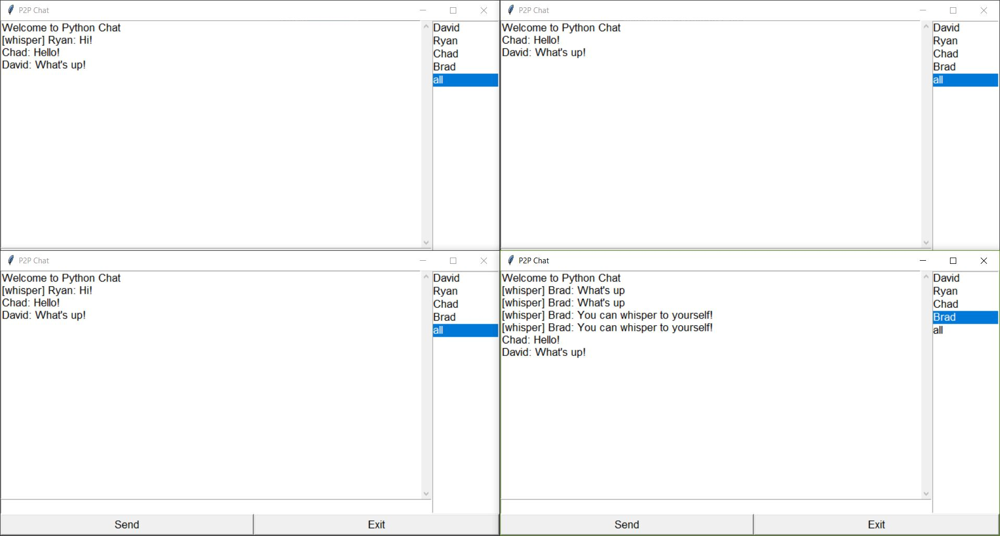

# P2PChat
## EC441 Final Project 
### Written by Ryan Ewing and David Li
#### 12.11.18

This project uses the Python 3 interpreter. 

# How to use:
* Run `python Client.py` to start a client.
* A window will come up asking for a **Host**, **Port**, and **Name**.
* To host your own server, place a valid IP address into the **Host** entry. Enter a port number and then click the **Host** button. 
    * You can leave this section blank to host a local server.
* Once a known server is running, enter the IP address in the **Host**, the appropriate port in **port**, and your name in **Name**.
* Click join and you will enter the chat room. 
* In the chat room, you can choose who you want to message to on the right hand side of the chat box. 
    * There are private messages and public messages.
        * To talk to a specific person, click on their name on the right hand side.
        * To talk to everyone in the chat room, click on *all*
* You may send the message by clicking the *send* button or pressing enter when there is text in the text box.
* To exit, click on the *exit* button. 

#### Server Pass Off
* When the person hosting the server exits, the program will attempt to find another person to host the server.
    * If there are no other chat users, the program will quit.
    * If there are one or more other users, then the program will pass the server to the oldest user (the user who joined closest in time to the host).

# Files
There are three files in this application:
* Client.py 
* GUI.py 
* Server.py

The functions in each file is described below.

## Client.py
This file is responsible for 
* **def connect()** - Connects to an ip and a port (this is a server essentially).
* **def host_server()** - Starts a server.
* **def run()** - Main loop to receive data and write data to a socket.
* **def process_message()** - Processes a recevied message; depending on the type, takes a different action. Here are the different types of messages:
    * Message
    * Private
    * login
    * transfer 
    * connect

* **def send_message()** - Sends a message.
* **def notify_server()** - Log in and log out, notifies the server of an action, and changes the client itself. In most cases, just places an action in the queue.

## Server.py
This file is responsible for 

* **def init()** - Binds the socket to a host and port (address) and listens to it for connections.
* **def run()** - Main thread, keeps the server alive while you want it to.

### Each of these functions is a separate thread:
* **def listen()** - Thread listening to incoming connections.
* **def receive()** - Receives data and calls process_data on the data.
* **def send()** - Sends a message from the queue if there is one to be sent.

* **def send_to_all()** - Sends the data to all the users.
* **def send_to_one()** - Specified function that sends to one specific target. Used for whisper and transfer of server.
* **def process_data()** - Functionality is similar to process_message. When sending data across sockets, most have an encoding. You cannot just send strings across the connection.
* **def remove_connection()** - Removes a user / socket that disconnected from the list.
* **def update_login_list()** - Tell users about a new person who joins the lobby and tells users to update their list.

## GUI.py
This file is responsible for 

There are four different classes in this file:
1. class GUI

    * **def run()** - Runs the GUI file to produce two windows. A *LogInWindow* is created and will keep running until a button is pressed. This is how the *LogInWindow* switches to the Chat room window. 
    * **def display_alert** - Displays a pop up window when an error occurs.
    * **def update_login_list()** - Updates the login list for the current user.
    * **def display_message()** - Displays a recently recevied message.
    * **def send_message()** - Sends the user's message to the server.
    * **def set_target()** - Sets the target the user wants to send a private message to.
    * **def notify_server()** - Sends a particular action to the server.
    * **def login()** - Notifies the server that a login action is occurring.
    * **def logout()** - Notifies the server that a logout action is occurring.
    * **def center()** - Centers the window.
2. class Window
    Initializes the window. Sets the parameters for the font and title.

3. class LoginWindow

    * **def build_window()** - Tkinter code to build the login window.
    * **def run()** - Creates a mainloop for the login window to exist, termiantes when exited.
    * **def join_server()** - Obtain information from the login box to join a specific server. Will show a pop up if the user is unable to reach the server.
    * **def start_server()** - Starts the server.

4. class ChatWindow

    * **def build_window()** - Builds the tkitner window for the chat room.
    * **def run()** - Creates a mainloop for the Chat room window to exist, termiantes when exited.
    * **def display_message()** - Displays a message in the ScrolledText widget.
    * **def transfer_server()** - Transfers the server to another user.
    * **def on_closing_event()** - Called when a window is closed.
    * **def exit_event()** - Sends a logout message and quits application when the *Exit* key is pressed.
    * **def send_entry_event()** - Sends a message from the entry field to the specified target(s).
    * **def selected_login_event()** - Set a target currently selected on the login list.
    * **def update_login_list()** - Update the listbox with a list of active users in the Chat room. 
